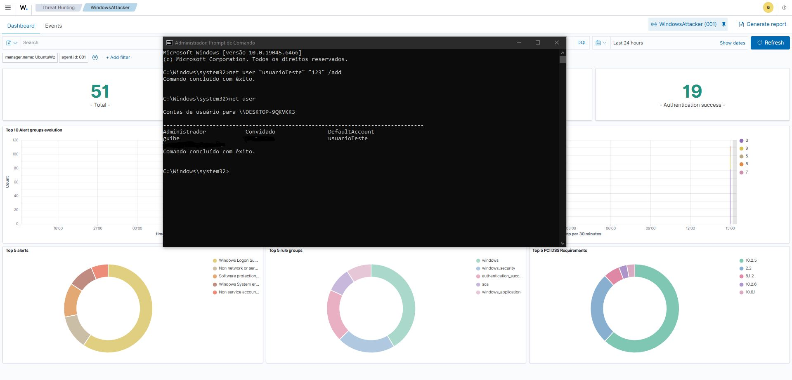
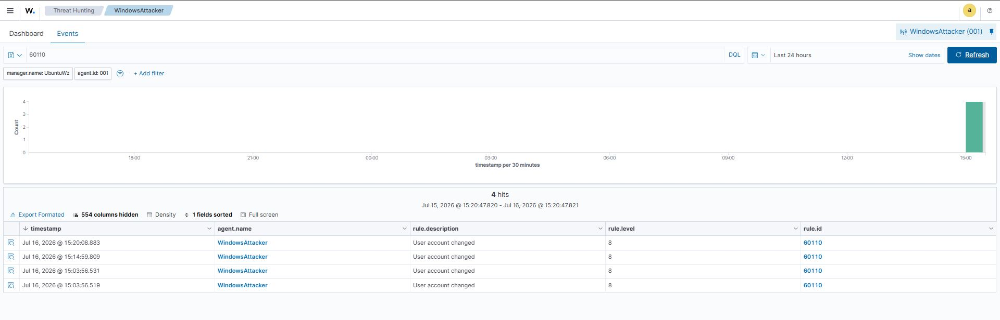

# UC-003 - Monitoramento de Adição de usuário

## Objetivo

Validar se o Wazuh identifica a criação de novos usuários por meio da máquina atacante. 

---

## Cenário

Foram realizados os comandos na máquina windows por meio do CMD: net user "NomeDoUsuario" "SenhaDoUsuario" /add

---

## Resultado Esperado

O Windows tende a registrar a adição de um novo usuário sendo bem sucedida.

O Wazuh deve identificar os eventos e alertas além de registra-los, categorizando os devidamente em sua severidade correta e apresentando os detalhes sobre o evento. 

---

## Resultado Obtido

Foram identificados eventos relacionados à:

Rule ID:
60110

Descrição:
User account changed

Nível:
8

---

## Evidências

---

## Análise

As tentativas de criação de um novo usuário pela máquina atacante foram registradas com sucesso pelo sistema operacional com o agente wazuh inserido. 

Os eventos foram coletados pelo wazuh, onde foi aplicado pelo mesmo a regra de correlação e gerou os alertas classificados e categorizados como nível 8. 

Ação a ser tomada é a investigação sobre o evento e a documentação. 

---

## Possíveis Aplicações

Esse tipo de alerta pode auxiliar na identificação de:

- Backdoors: A ação de backdoors consiste na ação de criação de novos usuários para manter o acesso em ambiente mesmo com possíveis correções sobre segurança e acesssos. 

- Criação de novos usuários para utilização de forma indevida para mascarar ações proibidas ou fraudulentas. 

---

## Lições Aprendidas

Foi possível compreender sobre os alertas gerados provenientes por meio da ação de inserção de um novo usuário. Desta maneira, seguindo a partir do nível da severidade categorizada na documentação do ocorrido. 
