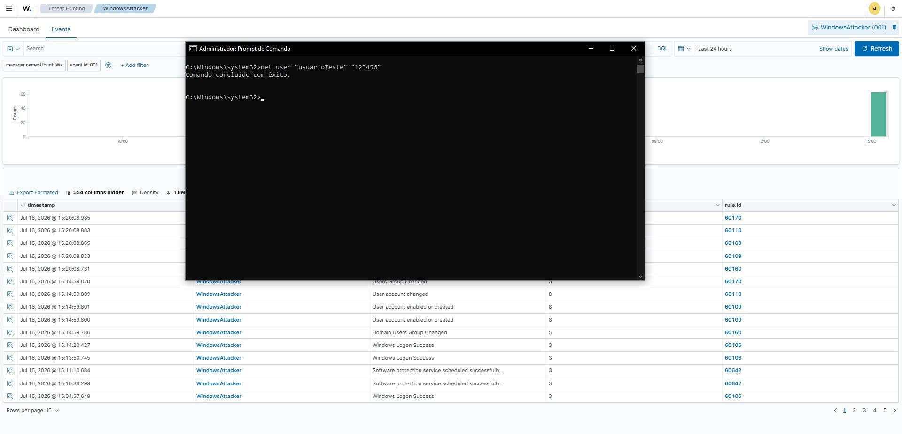
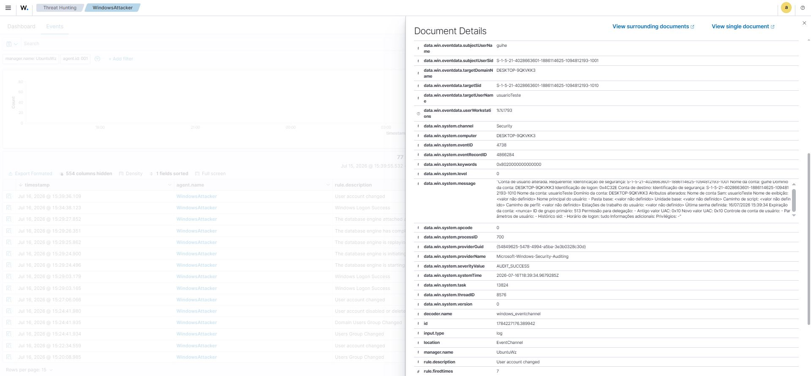

# UC-004 - Monitoramento de Alteração de senha de usuário

## Objetivo

Validar se o Wazuh identifica alterações sobre a senha de um usuário já inserido em ambiente. 

---

## Cenário

Foram utilizados por meio do CMD os seguintes comandos para ação de alteração de senha do usuário: net user "NomeDoUsuario" "NovaSenha"

---

## Resultado Esperado

Windows tende a registrar a alteração da senha de um usuário sendo bem sucedida.

O Wazuh deve identificar os eventos e alertas além de registra-los, categorizando os devidamente em sua severidade correta e apresentando os detalhes sobre o evento e qual o usuário foi afetado sobre esta ação. 

---

## Resultado Obtido

Foram identificados eventos relacionados à:

Rule ID:
60110

Descrição:
User account changed

Nível:
8

---

## Evidências

---

## Análise

As tentativas de alteração de senha de um usuário pela máquina atacante foram registradas com sucesso pelo sistema operacional com o agente wazuh inserido. 

Os eventos foram coletados pelo wazuh, onde foi aplicado pelo mesmo a regra de correlação e gerou os alertas classificados e categorizados como nível 8. 

Ação a ser tomada é a investigação sobre o evento e a documentação com a máxima riqueza de informações. 

---

## Possíveis Aplicações

Esse tipo de alerta pode auxiliar na identificação de:

- Alteração de credenciais indevidamente para manter acesso futuro. 

- Invasão e sequestro do acesso de usuários para bloqueio do usuário legitmo e assumir o controle.  

- Atividade Maliciosa: Usuário interno mudando senha de usuário sobre outros colaboradores para causar a interrupção de negócios. 

---

## Lições Aprendidas

Foi possível compreender sobre os alertas gerados provenientes por meio da ação de alteração de senha de um usuário. Desta maneira, seguindo a partir do nível da severidade categorizada na documentação do ocorrido. 