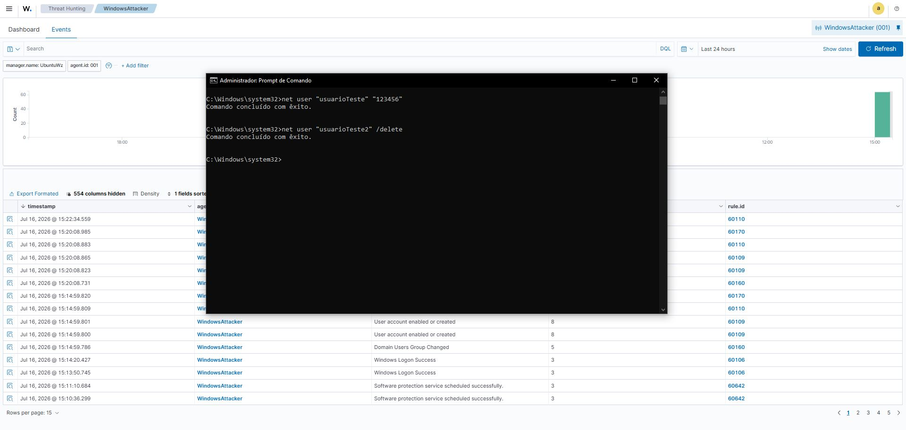
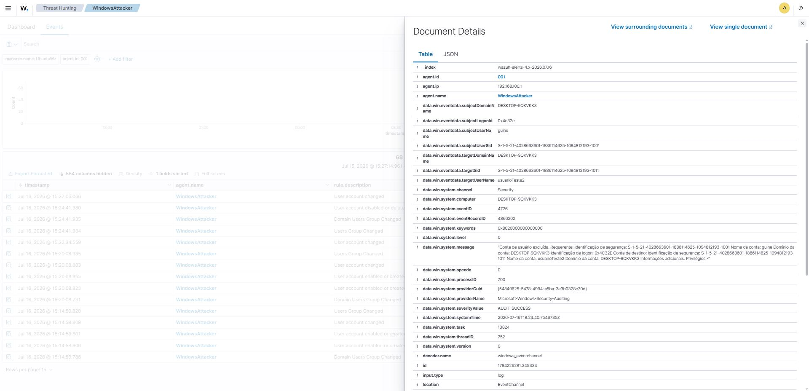

# UC-000 - Monitoramento de Exclusão de usuário

## Objetivo

Validar se o Wazuh identifica os alertas provenientes da ação de alteração de senha de um usuário. 

---

## Cenário

Foi realizado para a ação de exlusão o seguinte comando pelo CMD: net user "NomeDoUsuario" /delete

Para verficar os usuarios na maquina foi utilizado o comando no CMD : net user
---

## Resultado Esperado

Windows tende a registrar a exclusão de um usuário sendo bem sucedida.

O Wazuh deve identificar os eventos e alertas além de registra-los, categorizando os devidamente em sua severidade correta e apresentando os detalhes sobre o evento e qual o usuário foi afetado sobre esta ação de exclusão. 

---

## Resultado Obtido

Foram identificados eventos relacionados à: 

Rule ID:
60111

Descrição:
User account disabled or deleted

Nível:
8

---

## Evidências

---

## Análise

As ação de exclusão de um usuário pela máquina atacante foi registrada com sucesso pelo sistema operacional com o agente wazuh inserido. 

Os eventos foram coletados pelo wazuh, onde foi aplicado pelo mesmo a regra de correlação e gerou os alertas classificados e categorizados como nível 8. 

Ação a ser tomada é a investigação sobre o evento e a documentação com a máxima riqueza de informações. 

---

## Possíveis Aplicações

Esse tipo de alerta pode auxiliar na identificação de:

- Possível Ataque de negação de serviçõs (DOS). Se gerado a exclusão em massa de usuários, paralisando operações de login. 

- Possível Ataque interno sobre a exclusão de contas críticas para o negócios (Como contas administradoras ou contas de serviço), interrompendo assim as operções em seu fluxo natural.

- Possível queima de arquivos ou eliminação de evidências de atacantes sobre ações indevidas realizadas ou sobre possíveis ataques realizados. Dificultando assim o fluxo de investigação sobre os eventos gerados anteriormente. 

---

## Lições Aprendidas

Foi possível compreender sobre os alertas gerados provenientes por meio da ação de exclusão de um usuário. Desta maneira, seguindo a partir do nível da severidade categorizada na documentação do ocorrido e a investigação sobre todo o evento gerado. 